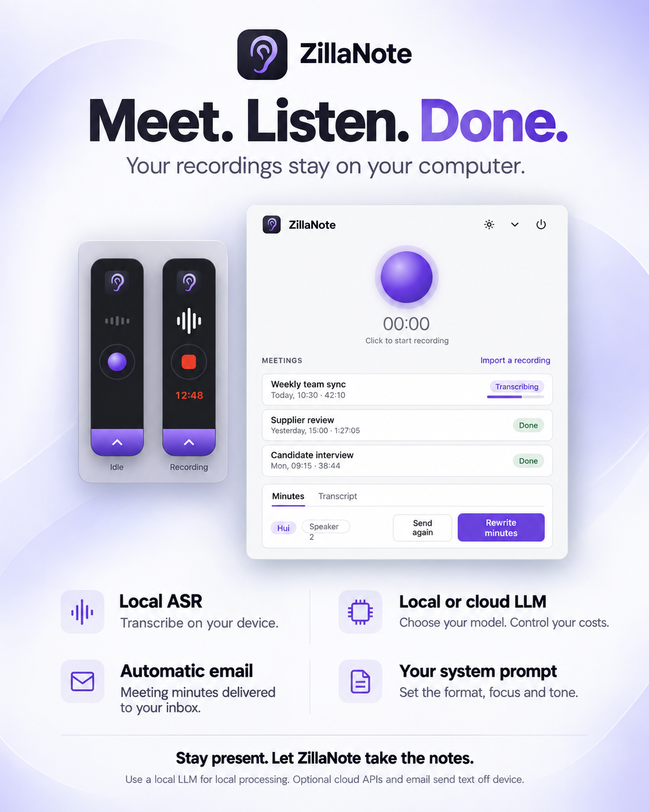

# ZillaNote lite

  <strong>Record a meeting, get the minutes in your inbox.</strong> 
  Transcribed on your own computer. Free and open source.

  
  &nbsp;
  

  One click downloads the latest version. The <a href="https://mayhuifu.github.io/zillanote-lite/">website</a> picks the right one for your computer.
  The first start needs <a href="#install">one extra click</a>.

  

  
  

ZillaNote sits as a small bar at the edge of your screen. Press record when the meeting
starts; when you stop, it writes the transcript with who said what, turns it into minutes,
and mails them to you. The recording never leaves your computer.

## Why ZillaNote

- **Your recordings stay yours.** Audio is recorded and transcribed on your computer. It is
  never uploaded, and nothing is ever sent to the people who make ZillaNote.
- **Free. No account, no subscription.** Open source under MIT or Apache-2.0: use it at
  home or at work, change it, share it.
- **Your model, your costs.** The minutes come from the language model you choose: one on
  your own computer (LM Studio, Ollama), free and private, or any OpenAI-compatible service
  with your own key, paying only for what you use.
- **Nothing to do after the meeting.** One button. The transcript, the speaker names and the
  minutes arrive by themselves.

## Features

- **One button.** A small bar floats at the edge of the screen: record, stop, and a progress
  ring while the minutes are written. The menu-bar icon does the same.
- **Transcription on your device.** Qwen3-ASR runs on your computer, in two sizes: a light
  default, and a more accurate one for meetings that mix English and Mandarin.
- **Both sides of the call.** Your computer's sound is recorded along with your microphone,
  so the other side of a Teams, Zoom or Meet call is in the transcript, even on loudspeakers.
- **Knows when a call starts and ends.** The record button flashes when a call begins, and
  the recording stops by itself shortly after the call ends. It never starts a recording on
  its own.
- **Who said what.** Every line of the transcript has its speaker. Name a voice once and it
  is recognized in later meetings.
- **Minutes your way.** Topics, decisions, next steps with their owners, and what was left
  open, on one page. Pick a template (discussion, business meeting, interview) or edit the
  system prompt to set the format, focus and tone.
- **Delivered to your inbox.** The minutes are mailed to you from your own mail account as
  soon as they are written.
- **Bring older recordings.** Drop in a recording made elsewhere and get minutes from it too.
- **Plain files.** Every meeting is a folder on your disk: the audio, the transcript and the
  minutes. Nothing is locked in.

## Install

| | Needs | Download |
|---|---|---|
| **Mac** | Apple silicon, macOS 12 or later (14.2 or later for the other side of calls, and for noticing when they start and end) | [`ZillaNote_aarch64.dmg`](https://github.com/mayhuifu/zillanote-lite/releases/latest/download/ZillaNote_aarch64.dmg) |
| **Windows** (preview) | Windows 10 or 11, x64 | [`ZillaNote_x64-setup.exe`](https://github.com/mayhuifu/zillanote-lite/releases/latest/download/ZillaNote_x64-setup.exe) |

Earlier versions and the release notes are on the [releases page](https://github.com/mayhuifu/zillanote-lite/releases).
The installers are not yet signed by a registered developer, so the first start takes one
extra click: on a Mac, **System Settings → Privacy & Security → Open Anyway**; on Windows,
**More info → Run anyway**. The release notes have the steps in full.

On the first start ZillaNote offers to download its speech model (0.9 GB, once). Then, in
Settings, point it at a language model for the minutes and, if you like, a mail account to
send them from.

## Privacy

Audio is recorded to your computer and transcribed there. Only the transcript leaves it, and
only for the language model you set, which can itself run on your computer; the minutes go
only to the mail server you set. There is no account and no analytics, and nothing is sent to
the authors of ZillaNote. [The details](docs/HOW-IT-WORKS.md#privacy).

## Free and open source

ZillaNote lite is free to use, at home or at work, and its code is open: licensed under
either the [MIT License](LICENSE-MIT) or the [Apache License 2.0](LICENSE-APACHE), at your
option.

It stands on the work of others: [Qwen3-ASR](https://huggingface.co/Qwen/Qwen3-ASR-1.7B) and
[llama.cpp](https://github.com/ggml-org/llama.cpp) for speech, [pyannote](https://huggingface.co/pyannote/segmentation-3.0)
and [WeSpeaker](https://github.com/wenet-e2e/wespeaker) on [ONNX Runtime](https://github.com/microsoft/onnxruntime)
for telling speakers apart, and [Tauri](https://github.com/tauri-apps/tauri) for the app. What it is built on,
ships with and downloads, and their licenses, are listed in
[`THIRD-PARTY-NOTICES.md`](THIRD-PARTY-NOTICES.md).

## Learn more

- [Website](https://mayhuifu.github.io/zillanote-lite/): the download for your computer.
- [How it works](docs/HOW-IT-WORKS.md): every part in detail, and what is not built yet.
- [Building from source](docs/DEVELOPMENT.md): run, build, test, and the layout of the code.
- [Release notes](https://github.com/mayhuifu/zillanote-lite/releases): what is new in each
  version, and the known limits.
- [Contributing](CONTRIBUTING.md): issues and pull requests are welcome.
- [Security](SECURITY.md): report a vulnerability privately.

If ZillaNote saves you time, a star helps others find it.
